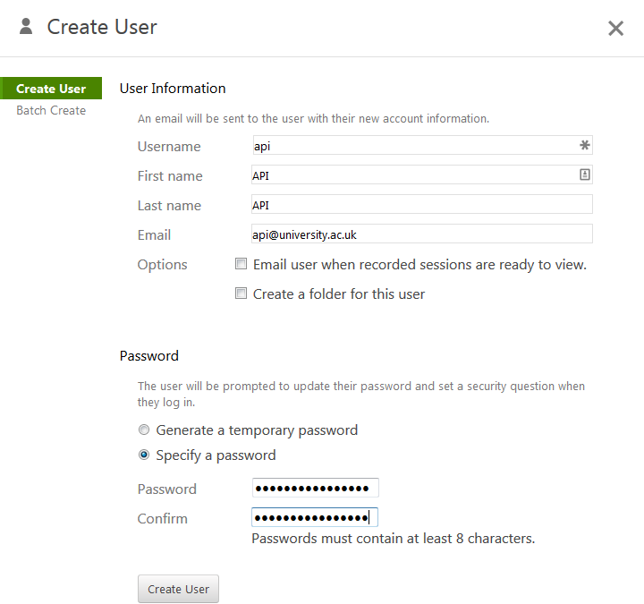
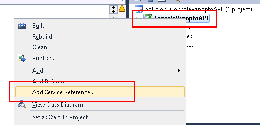
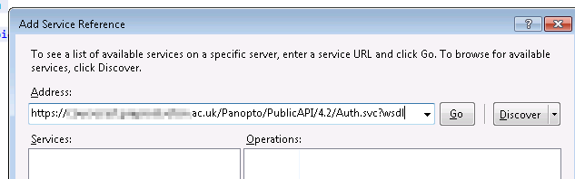
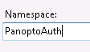
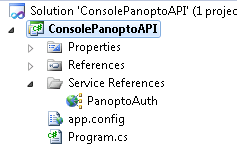
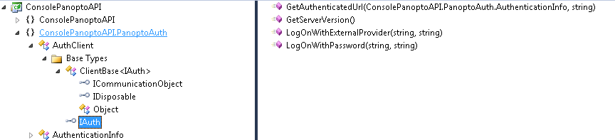

In this first example we’re going to connect to the Panopto server using a username and password.

Firstly you will need to connect to your Panopto server and add a new user. In this example I used the username “api” and the password “s2ezupajePhasaP5”




Once the user exists you will need to give it some permissions. You should give the user only the permissions it needs. If you are using a development server then I’d recommend making it an administrator when following these instructions.

Click settings and set the role to administrator


We now have a user that can connect to the server. Horray!

Open Visual Studio and create a new Command Line C# application

If you’d like to copy and paste my example code I recommend calling your application

`ConsolePanoptoAPI`

If everything has gone to plan you should have some code like this

```
using System;
using System.Collections.Generic;
using System.Linq;
using System.Text;

namespace ConsolePanoptoAPI
{
    class Program
    {
        static void Main(string[] args)
        {
        }
    }
}
```

This is all fine, but the reason to use C# is that it knows all the possible commands that Panopto accepts. So we need to add the services to our application.

Right click on ConsolePanoptoAPI (or your application name) and select **Add Service Reference**



A screen will pop up asking you for an address. You’ll need to enter the following

`https://[your panopto server here]/Panopto/PublicAPI/4.2/Auth.svc?wsdl`

For example, if your server is panopto.university.ac.uk then put `https://panopto.university.ac.uk/Panopto/PublicAPI/4.2/Auth.svc?wsdl` into the address box. Press Go



Some services should appear in the box. Before you finish type

`PanoptoAuth`
into the Namespace box



If everything has worked correctly you’ll see PanoptoAuth in the solution explorer



We can now use this simple service reference. Put this code between the curly brackets of static void Main(string[] args) {}

```
PanoptoAuth.AuthenticationInfo sessionAuthInfo = new PanoptoAuth.AuthenticationInfo()
{
    UserKey = "api",
    Password = "s2ezupajePhasaP5"
};
```

These are the log in details we made earlier. You’ll need this sessionAuthInfo within all the other commands we make

We could carry on writing PanoptoAuth. in front of our commands, but we can write

using ConsolePanoptoAPI.PanoptoAuth;
At the top of the console application to tell visual studio to expect commands from that namespace.

You may have noticed when adding the service reference that Auth has a very small amount of commands within it (which is why I’ve used it first). One of those commands is GetServerVersion and we can use it now.

Add the following code after the }; of PanoptoAuth.AuthenticationInfo

```
IAuth iAuth = new AuthClient();
Console.WriteLine(iAuth.GetServerVersion());
Console.ReadLine();
```

Lets start at the bottom and work up.

`Console.ReadLine()`
This makes the command prompt window wait for you to type something in. It simply makes it so that the window doesn’t close a few milliseconds after you run your program.

`Console.WriteLine(iAuth.GetServerVersion());`
Console.WriteLine outputs whatever is within the brackets

`iAuth.GetServerVersion()`
So how did I know that this command existed? Well if you double click on PanoptoAuth in the Solutions Explorer you’ll see the commands that are available. You’ll also notice that GetServerVersion is under IAuth.




`IAuth iAuth = new AuthClient();`
Finally the structure above tells which object we need to make and the class of the object.

Finally we run the program and get our output


The output after running our program

Our code now looks like this

```
using System;
using System.Collections.Generic;
using System.Linq;
using System.Text;
using ConsolePanoptoAPI.PanoptoAuth;

namespace ConsolePanoptoAPI
{
    class Program
    {
        static void Main(string[] args)
        {
            AuthenticationInfo sessionAuthInfo = new AuthenticationInfo()
            {
                UserKey = "api",
                Password = "s2ezupajePhasaP5"
            };

            IAuth iAuth = new AuthClient();
            Console.WriteLine(iAuth.GetServerVersion());
            Console.ReadLine();
        }
    }
}
```


