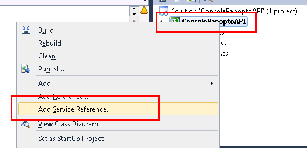

We’ll now add all the Panopto service references. In a real integration you would only add the services you actually need.

Using the application made in 001 add a new service reference




And add the following one by one

`https://[your panopto server here]/Panopto/PublicAPI/4.2/AccessManagement.svc?wsdl`

Called PanoptoAccessManagement

`https://[your panopto server here]/Panopto/PublicAPI/4.2/RemoteRecorderManagement.svc?wsdl`

Called PanoptoRemoteRecorderManagement

`https://[your panopto server here]/Panopto/PublicAPI/4.2/SessionManagement.svc?wsdl`

Called PanoptoSessionManagement

`https://[your panopto server here]/Panopto/PublicAPI/4.2/UsageReporting.svc?wsdl`

Called PanoptoUsageReporting

`ttps://[your panopto server here]/Panopto/PublicAPI/4.2/UserManagement.svc?wsdl`

Called PanoptoUserManagement

This should leave you with 6 service references as Auth should already exist.

You should now add these Namespaces to your using list at the top of the page

```
using ConsolePanoptoAPI.PanoptoAccessManagement;
using ConsolePanoptoAPI.PanoptoAuth; // This one should already exist
using ConsolePanoptoAPI.PanoptoRemoteRecorderManagement;
using ConsolePanoptoAPI.PanoptoSessionManagement;
using ConsolePanoptoAPI.PanoptoUsageReporting;
using ConsolePanoptoAPI.PanoptoUserManagement;
```
If you try to compile this program, you’ll see that we now have an issue. AuthenticationInfo is used by both PanoptoAuth and PanoptoAccessManagement (it’s actually used by all of them). To fix this we’ll have to add a namespace to the code.

PanoptoAuth.AuthenticationInfo sessionAuthInfo = new PanoptoAuth.AuthenticationInfo()
Our full code now looks like this

```
using System;
using System.Collections.Generic;
using System.Linq;
using System.Text;
using ConsolePanoptoAPI.PanoptoAccessManagement;
using ConsolePanoptoAPI.PanoptoAuth;
using ConsolePanoptoAPI.PanoptoRemoteRecorderManagement;
using ConsolePanoptoAPI.PanoptoSessionManagement;
using ConsolePanoptoAPI.PanoptoUsageReporting;
using ConsolePanoptoAPI.PanoptoUserManagement;

namespace ConsolePanoptoAPI
{
    class Program
    {
        static void Main(string[] args)
        {
            PanoptoAuth.AuthenticationInfo sessionAuthInfo = new PanoptoAuth.AuthenticationInfo()
            {
                UserKey = "api",
                Password = "s2ezupajePhasaP5"
            };

            IAuth iAuth = new AuthClient();
            Console.WriteLine(iAuth.GetServerVersion());
            Console.ReadLine();
        }
    }
}
```
