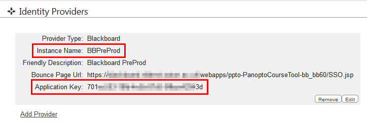

I’ll be honest, this process has taken 3 hours, whereas it should take 3 minutes. Either this will ease someone’s day or you’ll find this page on Google after 2 1/2 hours of keyboard bashing.

This code continues from the 

The official documentation for using an AuthCode is here: http://support.panopto.com/pages/PanoptoApiHelp/html/487185e4-b175-e09f-e2f5-1fcf6864fd62.htm

It says we need to construct

`    SHA1(UserKey + “@” + WebServerFQDN.ToLower() + “|” + applicationKey.ToLower())`

So we need to do a few things.

Firstly we need to build a function that is going to create a SHA1 hash of these things. Paste the following code as a function at the bottom of the page. It needs to be after static void main() but before the } of class Program.

```
/// <summary>
/// Creates an auth code. Used when we want to authenticate a user, but don't know their password.
/// </summary>
/// <param name="identityProviderInstanceName">The instance name as set in Panopto > System > Identity Providors</param>
/// <param name="username">Username as defined by Panopto</param>
/// <param name="serverFqdn">The full server name as defined by Panopto > System > Settings > General site settings > Web server FQDN</param>
/// <param name="applicationKey">The key produced through Panopto > System > Identity Providors</param>
/// <returns></returns>
private static string CreateAuthCode(string identityProviderInstanceName, string username, string serverFqdn, string applicationKey)
{
    string payload = identityProviderInstanceName + "\\" + username + "@" + serverFqdn.ToLower() + "|" + applicationKey.ToLower();

    var data = Encoding.ASCII.GetBytes(payload);
    var hashData = new System.Security.Cryptography.SHA1Managed().ComputeHash(data);

    var hash = string.Empty;

    foreach (var b in hashData)
        hash += b.ToString("X2");

    return hash;
}
```

The `///` lines at the top are what make the tool tips you see when you start writing the function name. Think of them as comments you see only when they are useful to you.

We make the function with CreateAuthCode() but it expects to be passed the things mentioned in the official documentation.

`identityProviderInstanceName` and `identityProviderApplicationKey` are found in the Panopto > System > Identity providers screen. You’ll need to make one if you don’t have Blackboard / Moodle / etc intergration already



The string payload command joins everything back together. Note that if your username is api and your Instance name is blackboard then your username is blackboard\api. In C# the backslash character needs escaping.

`.ToLower()` makes sure that the variable is lower case. The identityProviderInstanceName and username should match the case written on the server.

The So the final line is

`string payload = identityProviderInstanceName + "\\" + username + "@" + serverFqdn.ToLower() + "|" + applicationKey.ToLower();`

The rest of the function creates a SHA1 hash (credit to http://www.kindblad.com/2009/03/how-to-generate-sha-1-hash-of-string.html)

Now the function exists, we need to call it.

In static void Main() replace the existing code with the following

```
PanoptoAuth.AuthenticationInfo sessionAuthInfo = new PanoptoAuth.AuthenticationInfo()
{
    UserKey = "api",
    Password = "s2ezupajePhasaP5"
};

EnsureCertificateValidation();

string panoptoFqdn = "panopto.university.ac.uk";
string username = "api";
string identityProviderInstanceName = "BBPreProd";
string identityProviderApplicationKey = "70xxxxx-xxxx-xxxx-xxxx-xxxxxxxxx3d";

Console.WriteLine("The following line would log " + username + " into Panopto using the identity provider " + identityProviderInstanceName);
Console.WriteLine(CreateAuthCode(identityProviderInstanceName, username, panoptoFqdn, identityProviderApplicationKey));

Console.WriteLine("Press Enter to continue");
Console.ReadLine();

PanoptoSessionManagement.AuthenticationInfo sessionAuthInfoSSO = new PanoptoSessionManagement.AuthenticationInfo()
{
    UserKey = identityProviderInstanceName + "\\" + username,
    AuthCode = CreateAuthCode(identityProviderInstanceName, username, panoptoFqdn, identityProviderApplicationKey)
};

Console.WriteLine("Press Enter to continue");
Console.ReadLine();
```

The first few lines are redundant, we made them in 001. Next we check the security we created in 003.

The next few lines we are going to define who we are. *panoptoFqdn* is the website as defined in Panopto > System > Settings > General site settings > Web server FQDN. This should be the same as the address in your address bar, but it doesn’t hurt to check. username is the name we’re going to log in with and the identity… variables were explained above.

**Remember that the user above is BBPreProd\api which is different to the local api user we created in the earlier steps.**

The next lines export the auth string (in case you want to compare it to an external service such as http://www.sha1-online.com/)

Next we create an AuthenticationInfo object (we’ve named it sessionAuthInfoSSO so it is unique)

To aid simplicity I haven’t included any code to check this login, but you can try it with any of the example code in later posts.


