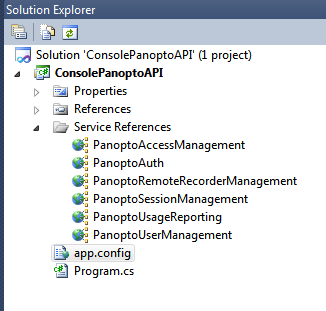
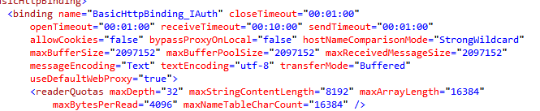
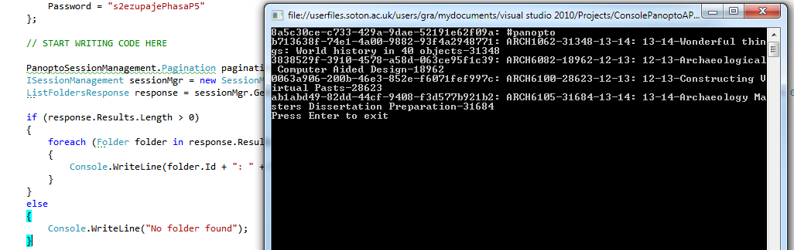

In this example we’re going to get a list of our folders. If you’re on a new server this is quite easy, but with a long list you may crash Visual Studio.



Double click app.config to open it up

Now adjust all the *maxBufferSize, maxBufferPoolSize, and maxReceivedMessageSize* values to 2097152. They are in multiple locations as we have added multiple service references.



Hopefully now we can receive a decent amount of data back from the server, however the program will still crash if it receives multiple hundreds of folders back. We’ll deal with this by bringing back 5 at a time. We do this with pagination.

Under // START WRITING CODE HERE from the  write

`PanoptoSessionManagement.Pagination pagination = new PanoptoSessionManagement.Pagination { MaxNumberResults = 5, PageNumber = 0 };`

Here we’re making a new pagination object and telling it that we want 5 results at a time and to start from the beginning (page 0).

Did you notice that we’re using the `PanoptoSessionManagement` namespace? If we’re using that namespace, and we need to authenticate, we need to use `PanoptoSessionManagement.AuthenticationInfo`

Paste the following code in the // PUT YOUR AUTHENTICATION DETAILS HERE section

```
PanoptoSessionManagement.AuthenticationInfo sessionAuthInfo = new PanoptoSessionManagement.AuthenticationInfo()
{
    UserKey = "api",
    Password = "s2ezupajePhasaP5"
};
```

Next we’ll ask for our folders

```
ISessionManagement sessionMgr = new SessionManagementClient();
ListFoldersResponse response = sessionMgr.GetFoldersList(sessionAuthInfo, new ListFoldersRequest { Pagination = pagination, ParentFolderId = Guid.Empty, SortIncreasing = true }, null);
```

First we made an object (sessionMgr) that we can use to call GetFoldersList, then called the command and put it into an object (ListFoldersReponse) made to contain folders. These commands are explained in 

If you were to debug this command now, you’d see we have an array of folders. They are filtered and sorted due to the text under `ListFoldersRequest`.

 = … this is the pagination object mentioned above. It’s set to 5 results starting from the beginning (page 0)
 = … this is will only search for subfolders of a folder with this ID. We’ve told it to only search for parent folders by searching for 
 = true … this returns results from A-Z

(there are more options, but these are the ones I’m using)

Visual Studio can now see the results, but we aren’t outputting them. Paste this command in and C# will loop through the results and show 5 folders, if they exist

```
if (response.Results.Length > 0)
{
    foreach (Folder folder in response.Results)
    {
        Console.WriteLine(folder.Id + ": " + folder.Name);
    }
}
else
{
    Console.WriteLine("No folder found");
}
```

Run the program and you should see your folders



Full program code below

```
using System;
using System.Collections.Generic;
using System.Linq;
using System.Text;
using System.Net;
using System.Security.Cryptography.X509Certificates;
using ConsolePanoptoAPI.PanoptoAccessManagement;
using ConsolePanoptoAPI.PanoptoAuth;
using ConsolePanoptoAPI.PanoptoRemoteRecorderManagement;
using ConsolePanoptoAPI.PanoptoSessionManagement;
using ConsolePanoptoAPI.PanoptoUsageReporting;
using ConsolePanoptoAPI.PanoptoUserManagement;

// ANY NEW NAMESPACES SHOULD BE ADDED HERE

// END OF NAMESPACES

namespace ConsolePanoptoAPI
{
    class Program
    {
        static bool hasBeenInitialized = false;
        
        static void Main(string[] args)
        {
            // PUT YOUR AUTHENTICATION DETAILS HERE

            PanoptoSessionManagement.AuthenticationInfo sessionAuthInfo = new PanoptoSessionManagement.AuthenticationInfo()
            {
                UserKey = "api",
                Password = "s2ezupajePhasaP5"
            };

            // END OF AUTHENTICATION DETAILS

            // START WRITING CODE HERE

            PanoptoSessionManagement.Pagination pagination = new PanoptoSessionManagement.Pagination { MaxNumberResults = 5, PageNumber = 0 };
            ISessionManagement sessionMgr = new SessionManagementClient();
            ListFoldersResponse response = sessionMgr.GetFoldersList(sessionAuthInfo, new ListFoldersRequest { Pagination = pagination, ParentFolderId = Guid.Empty, SortIncreasing = true }, null);

            if (response.Results.Length > 0)
            {
                foreach (Folder folder in response.Results)
                {
                    Console.WriteLine(folder.Id + ": " + folder.Name);
                }
            }
            else
            {
                Console.WriteLine("No folder found");
            }

            // STOP WRITING CODE HERE

            Console.WriteLine("Press Enter to exit");
            Console.ReadLine();
        }

        /// <summary>
        /// Ensures that our custom certificate validation has been applied
        /// </summary>
        public static void EnsureCertificateValidation()
        {
            if (!hasBeenInitialized)
            {
                ServicePointManager.ServerCertificateValidationCallback += 
                    new System.Net.Security.RemoteCertificateValidationCallback(CustomCertificateValidation);
                hasBeenInitialized = true;
            }
        }

        /// <summary>
        /// Ensures that server certificate is authenticated
        /// </summary>
        private static bool CustomCertificateValidation(object sender, 
            X509Certificate cert, X509Chain chain, System.Net.Security.SslPolicyErrors error)
        {
            return true;
        }

        /// <summary>
        /// Creates an auth code. Used when we want to authenticate a user, but don't know their password.
        /// </summary>
        /// <param name="identityProviderInstanceName">The instance name as set in Panopto > System > Identity Providors</param>
        /// <param name="username">Username as defined by Panopto</param>
        /// <param name="serverFqdn">The full server name as defined by Panopto > System > Settings > General site settings > Web server FQDN</param>
        /// <param name="applicationKey">The key produced through Panopto > System > Identity Providors</param>
        /// <returns></returns>
        private static string CreateAuthCode(string identityProviderInstanceName, string username, string serverFqdn, string applicationKey)
        {
            string payload = identityProviderInstanceName + "\\" + username + "@" + serverFqdn.ToLower() + "|" + applicationKey.ToLower();

            var data = Encoding.ASCII.GetBytes(payload);
            var hashData = new System.Security.Cryptography.SHA1Managed().ComputeHash(data);

            var hash = string.Empty;

            foreach (var b in hashData)
                hash += b.ToString("X2");

            return hash;
        }
    }
}
```


